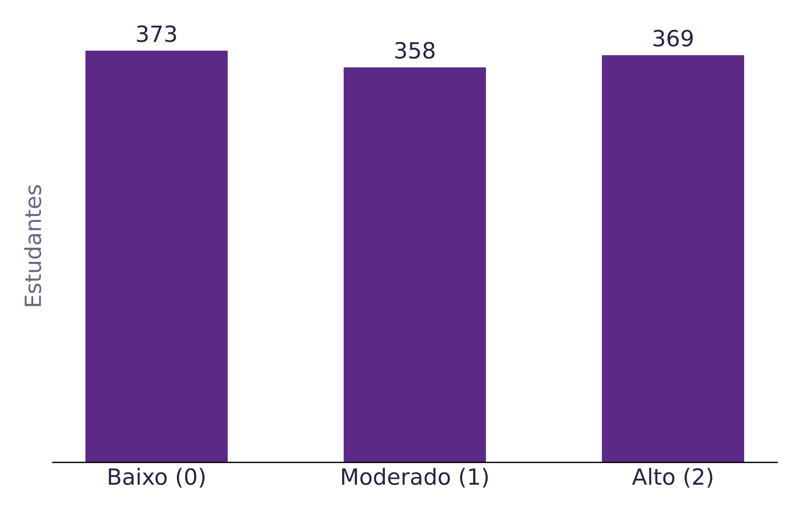
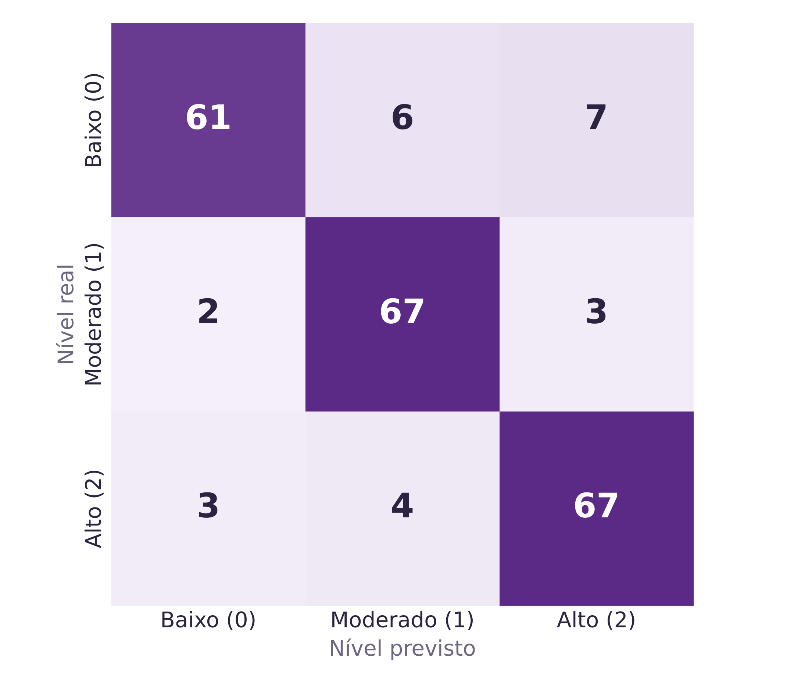
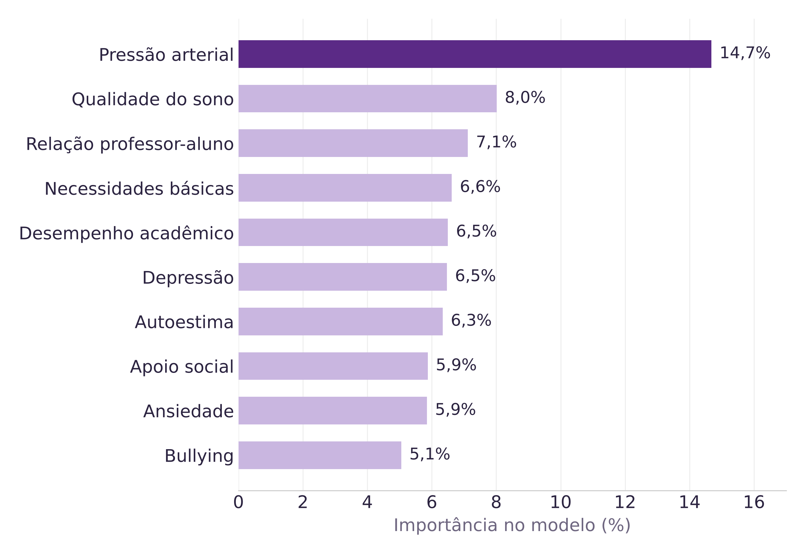

# EduStress AI

**Classificação e Identificação de Fatores de Estresse em Estudantes com Aprendizado de Máquina**

O **EduStress AI** é um projeto de Machine Learning desenvolvido para analisar dados relacionados ao cotidiano estudantil e **classificar o nível de estresse de estudantes** em três categorias (`0`, `1` e `2`).

Além da classificação, o projeto busca **identificar os fatores mais relevantes para as previsões realizadas pelo modelo**, permitindo uma análise dos aspectos que apresentam maior importância dentro dos dados utilizados.

> **Importante:** os resultados deste projeto representam o comportamento de um modelo de Machine Learning sobre o dataset utilizado. A importância das variáveis não deve ser interpretada como causalidade nem como diagnóstico psicológico ou médico.

---

## Objetivos

### Objetivo geral

Desenvolver um modelo de aprendizado de máquina capaz de classificar o nível de estresse de estudantes com base em fatores psicológicos, fisiológicos, ambientais, acadêmicos e sociais.

### Objetivos específicos

* Explorar e analisar a base de dados utilizada.
* Preparar os dados para treinamento do modelo.
* Desenvolver um classificador utilizando **Random Forest**.
* Otimizar os hiperparâmetros por meio de **GridSearchCV**.
* Avaliar o desempenho do modelo utilizando dados não utilizados no treinamento.
* Analisar a matriz de confusão e as métricas de classificação.
* Identificar as características mais relevantes para as previsões do modelo.

---

## Dataset

Fonte: [Student Stress Factors: A Comprehensive Analysis (Kaggle)](https://www.kaggle.com/datasets/rxnach/student-stress-factors-a-comprehensive-analysis).

O projeto utiliza o arquivo:

```text
data/StressLevelDataset.csv
```

A base possui:

* **1.100 registros**
* **21 colunas**
* **20 características (features)**
* **1 variável-alvo:** `stress_level`

A variável `stress_level` representa o nível de estresse utilizado pelo modelo como classe de classificação.

### Distribuição das classes

| Nível de estresse | Quantidade |
| ----------------- | ---------: |
| 0                 |        373 |
| 1                 |        358 |
| 2                 |        369 |
| **Total**         |  **1.100** |

A distribuição relativamente equilibrada entre as três classes permite a utilização de divisão estratificada para treinamento e teste.

---

## Principais características utilizadas

O dataset contém variáveis relacionadas a diferentes aspectos da vida estudantil.

Entre as características analisadas estão:

* Qualidade do sono
* Pressão sanguínea
* Relação entre professor e estudante
* Necessidades básicas
* Desempenho acadêmico
* Atividades extracurriculares
* Pressão acadêmica
* Relacionamentos
* Ambiente de estudo
* Ansiedade por desempenho
* Hábitos de estudo
* Sintomas fisiológicos

As características são utilizadas pelo modelo para encontrar padrões associados às classes de `stress_level`.

---

## Tecnologias utilizadas

* **Python**
* **Pandas**
* **NumPy**
* **Matplotlib**
* **Seaborn**
* **Scikit-learn**
* **Google Colab**
* **Jupyter Notebook**

### Algoritmo

O algoritmo principal utilizado é:

```text
Random Forest Classifier
```

---

## Metodologia

O projeto foi organizado em etapas de preparação, treinamento, otimização e avaliação.

### 1. Carregamento dos dados

O arquivo `data/StressLevelDataset.csv` é carregado utilizando o Pandas. Se o notebook não encontrar o arquivo localmente (por exemplo, ao ser aberto direto no Google Colab), ele carrega a cópia publicada neste repositório:

```python
fonte = next((str(c) for c in candidatos if c.exists()), DATA_URL)
df = pd.read_csv(fonte)
```

Também são verificadas as dimensões da base, tipos de dados e valores ausentes.

---

### 2. Separação entre Features e Target

A variável utilizada como alvo é:

```text
stress_level
```

As demais colunas são utilizadas como características de entrada:

```python
X = df.drop(columns=['stress_level'])
y = df['stress_level']
```

---

### 3. Divisão dos dados

Os dados foram divididos em:

```text
80% → treinamento
20% → teste
```

Foi utilizada estratificação para preservar a distribuição das classes:

```python
train_test_split(
    X,
    y,
    test_size=0.2,
    random_state=42,
    stratify=y
)
```

Resultado:

* **880 amostras para treinamento**
* **220 amostras para teste**

---

### 4. Treinamento do Random Forest

Foi utilizado o `RandomForestClassifier` com `random_state=42`.

O Random Forest foi escolhido por ser adequado para dados tabulares e por permitir a análise da importância das características utilizadas pelo modelo.

Como o algoritmo utilizado é baseado em árvores de decisão, **não foi aplicada padronização com `StandardScaler`**.

---

### 5. Otimização dos hiperparâmetros

Os hiperparâmetros foram avaliados utilizando:

```text
GridSearchCV
```

com validação cruzada estratificada:

```text
StratifiedKFold
5 folds
shuffle=True
random_state=42
```

Foram avaliadas diferentes combinações de:

* `n_estimators`
* `max_depth`
* `min_samples_split`

### Melhores parâmetros encontrados

O melhor conjunto de parâmetros identificado foi:

```python
{
    'classifier__n_estimators': 100,
    'classifier__max_depth': 10,
    'classifier__min_samples_split': 2
}
```

---

## Resultados

O modelo apresentou os seguintes resultados.

### Validação cruzada

A melhor média de acurácia obtida durante o `GridSearchCV` foi:

```text
88,07%
```

### Conjunto de teste

Após selecionar o melhor modelo, ele foi avaliado no conjunto de teste:

```text
Acurácia: 88,64%
```

Isso significa que o modelo classificou corretamente aproximadamente **88,64% das 220 amostras do conjunto de teste**.

---

## Métricas de classificação

O notebook também calcula:

* **Precision**
* **Recall**
* **F1-score**
* **Accuracy**

por classe de estresse, permitindo avaliar não apenas a quantidade total de acertos, mas também o comportamento do modelo para cada nível individualmente.

O relatório completo é gerado diretamente pelo:

```python
classification_report(y_test, y_pred)
```

---

## Matriz de Confusão

A matriz de confusão é utilizada para visualizar:

* classificações corretas;
* erros entre níveis de estresse;
* confusões entre classes próximas.

O notebook gera automaticamente a matriz de confusão utilizando `seaborn`.

---

## Identificação dos fatores mais relevantes

Uma das etapas principais do **EduStress AI** é identificar quais características possuem maior importância para o modelo.

Para isso, são utilizadas as importâncias fornecidas pelo Random Forest:

```python
rf_model.feature_importances_
```

Entre as características que apresentaram maior importância no modelo estão:

| Fator                          | Importância |
| ------------------------------ | ----------: |
| `blood_pressure`               |      14,68% |
| `sleep_quality`                |       8,01% |
| `teacher_student_relationship` |       7,12% |
| `basic_needs`                  |       6,62% |
| `academic_performance`         |       6,50% |

Esses valores representam a **importância das características para o funcionamento do modelo**, e não uma relação causal.

---

## Visualizações

As figuras abaixo são geradas a partir do notebook e estão na pasta [`figures/`](figures/).

### Distribuição dos níveis de estresse



### Matriz de confusão (conjunto de teste)



### Importância das características



---

## Estrutura do repositório

```text
.
├── data/
│   └── StressLevelDataset.csv        # Dataset utilizado (Kaggle)
├── notebooks/
│   └── EduStress_AI.ipynb            # Notebook completo (executado, com saídas)
├── figures/                          # Gráficos usados no README e no banner
│   ├── distribuicao_classes.png
│   ├── importancia_fatores.png
│   └── matriz_confusao.png
├── docs/                             # Documentação do SUMMIT UMC 2026
│   ├── Resumo_Simples_EduStress_AI.pdf
│   └── Banner_EduStress_AI.pdf
├── requirements.txt                  # Dependências
└── README.md
```

## Documentação do Summit

* [Resumo simples (RCUMC)](docs/Resumo_Simples_EduStress_AI.pdf)
* [Banner do SUMMIT UMC 2026](docs/Banner_EduStress_AI.pdf)

---

## Como executar

### Google Colab

1. Abra o notebook direto no Colab: [](https://colab.research.google.com/github/rayanelbarbosa/EduStress_AI/blob/main/notebooks/EduStress_AI.ipynb)
2. Execute as células sequencialmente (**Ambiente de execução → Executar tudo**).

Não é necessário enviar o dataset: o notebook baixa automaticamente `data/StressLevelDataset.csv` deste repositório.

### Execução local

Instale as dependências:

```bash
pip install -r requirements.txt
```

Depois execute:

```bash
jupyter notebook notebooks/EduStress_AI.ipynb
```

---

## Limitações

O projeto apresenta algumas limitações que devem ser consideradas na interpretação dos resultados:

* O modelo depende exclusivamente das características presentes no dataset utilizado.
* Os resultados não garantem o mesmo desempenho em outras bases de estudantes.
* A importância das características não estabelece relações de causa e efeito.
* O modelo não deve ser utilizado para diagnóstico médico ou psicológico.
* A acurácia, isoladamente, não representa todas as dimensões de desempenho do classificador.

---

## Conclusão

O **EduStress AI** demonstrou a viabilidade da utilização de aprendizado de máquina para classificação de níveis de estresse em estudantes a partir das características disponíveis no dataset.

Utilizando **Random Forest**, otimização por **GridSearchCV** e validação cruzada estratificada, o modelo alcançou **88,07% de acurácia média na validação cruzada** e **88,64% de acurácia no conjunto de teste**.

Além da classificação, a análise das importâncias das características permitiu identificar quais fatores apresentaram maior relevância para as previsões realizadas pelo modelo, destacando-se `blood_pressure`, `sleep_quality`, `teacher_student_relationship`, `basic_needs` e `academic_performance`.

Dessa forma, o projeto combina **classificação supervisionada** e **análise de importância de características**, permitindo não apenas prever a classe de estresse, mas também investigar quais variáveis mais contribuíram para o comportamento do modelo dentro da base analisada.

---

## Projeto

**EduStress AI**

**Tema:** Classificação e Identificação de Fatores de Estresse em Estudantes com Aprendizado de Máquina.

## Equipe

**Pesquisadores/Desenvolvedores:** Graziela Pereira de Oliveira, Gustavo Di Risio, Murilo Novaes de Oliveira, Rafael Souza Santana e Rayane da Luz Barbosa

**Orientadora:** Profa. Alessandra da Silva Martins

**Universidade de Mogi das Cruzes (UMC)**, SUMMIT UMC 2026, categoria Inovação
